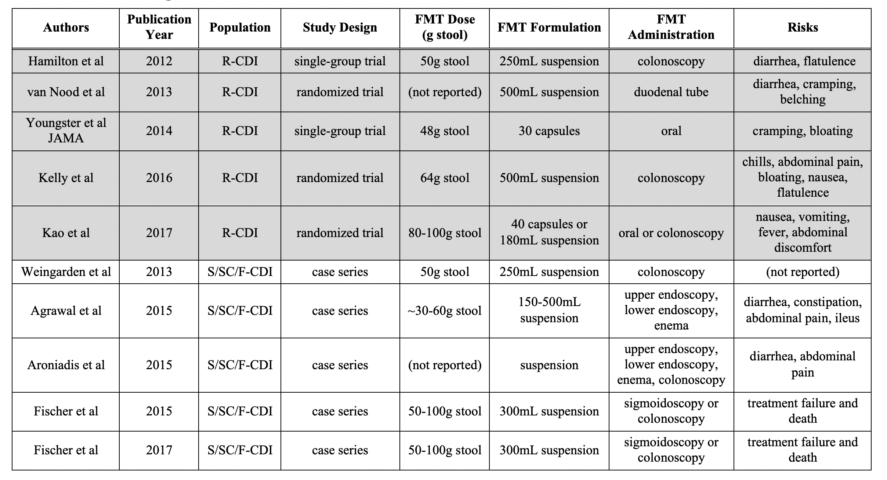

```{r setup, include=FALSE}
options(htmltools.dir.version = FALSE)
```

```{r xaringan-themer, include=FALSE, warning=FALSE, eval=FALSE}
library(xaringanthemer)
style_duo_accent(
  primary_color = "#011F5B",
  secondary_color = "#990000",
  inverse_header_color = "#FFFFFF",
  header_font_google = google_font("Roboto Condensed"),
  text_font_google = google_font("Roboto"),
  code_font_google = google_font("Roboto Mono"),
  # padding = "64px 64px 64px 64px"
  # base_font_size = "24px",
  # text_font_base = "1rem",
  # header_h1_font_size = "2.75rem",
  # header_h2_font_size = "2rem",
  # header_h3_font_size = "1.25rem",
)
```


# Disclosures

.pad-left[
- No conflicts of interest.  

- Opinions my own.  
]


---
background-image: url(svg/darkpink.svg)
background-size: 100px
background-position: 98% 90%
class: middle, inverse

.pad-left[

### Fecal microbiota transplantation (FMT):  
.pad-left[
####    ⇾ _Clostridioides difficile_ infection
]
.pad-left[
####    ⇾ inflammatory bowel disease (IBD)  
]
.pad-left[
####    ⇾ oncology: auto-FMT post allo-SCT; immune checkpoint inhibitors  
]
### Fecal microbiota transplantation regulatory oversight (& COVID-19)  
  
### Does it work? why?  
  
]


---
background-image: url(svg/darkpink.svg)
background-size: 100px
background-position: 98% 90%
class: center, middle, inverse

# FMT ⇾ CDI


---

# _Clostridioides difficile_ Infection

.pad-left[

- Depletion of protective taxa (abx & PPI) ⇾ altered bile acid metabolism ⇾ germination of resident or recently ingested _C. difficile_ spores ⇾ expansion of vegetative _C. difficile_ ⇾ toxin production ⇾ colonic inflammation ⇾ CDI

- Treatment with anti-CDI antibiotics (vancomycin, fidaxomicin) contributes to persistent depletion of protective taxa, risk for recurrent CDI

- **FMT restores colonization resistance by restoring protective taxa**

- Note: treatment with anti-CDI antibiotics is prerequisite

]


---
background-image: url(img/lee_yj_jid_2017.png)
background-size: 1000px
background-position: 50% 50%

.footnote[Lee YJ et al _J Infect Dis_ 2017]


---

.center[



]


---

# _C. difficile_ Treatment Guidelines  

.pull-left[

- IDSA/SHEA guidelines:

    - EIA vs PCR for diagnosis

    - vanco/fidaxo > metro

    - **FMT** for R-CDI

]

.pull-right[

]

.footnote[McDonald LC et al _Clin Inf Dis_ 2018]


---
background-image: url(img/cdiff_txrec_mark_recurrent.PNG)
background-size: contain


---

# Backlash Against FMT

.pad-left[

- Limited access and adverse events:  

    - March 19, 2019: OpenBiome nearly doubles prices  
    
    - June 13, 2019: FDA safety alert regarding FMT-related sepsis and death  
    
- Can same efficacy be achieved with antibiotics?

    - "Fecal microbiota transplantation (FMT) for C. difficile infection, just say 'No'" - Xing Tang & Stuart Johnson  

  
]

.footnote[Tan X & Johnson S _Anaerobe_ 2019; Defilipp Z et al _NEJM_ 2019; Blaser M _NEJM_ 2019]


---

# Commercial FMT: Phase 2/3 Trials

.pad-left[

- Multiple companies with "ecobiotic" FMT alternatives in phase 2/3 trials:  

    - Finch, Rebiotix, Seres, Vedanta  
    
    - FDA update planned after meeting November 4, 2019: concern that waiver of IND requirement limis RCTs

- May 6, 2020: "Rebiotix and Ferring are the first to announce positive preliminary results on primary efficacy endpoint from ongoing pivotal Phase 3 clinical trial for RBX2660"

]


---
background-image: url(svg/darkpink.svg)
background-size: 100px
background-position: 98% 90%
class: center, middle, inverse

# FMT ⇾ IBD


---
background-image: url(img/paramsothy_lancet_2017.png)
background-size: 700px
background-position: 50% 60%

# FMT for IBD: Successes


.footnote[Paramsothy et al _Lancet_ 2017]


---
background-image: url(img/qazi_t_gut_microbes_2017.png)
background-size: 700px
background-position: 50% 60%


.footnote[Qazi et al _Gut Microbes_ 2017]


---

# Misclassification Matters

.pad-left[

- Lesson from FMT for CDI trials (e.g., Seres):

    - misclassification of NAAT+ disease ⇾ bias

- Discordant results from IBD trials:

    - sub-phenotypes of IBD?
    
    - differential effects of microbial ecology?

- active FMT trials on clinicaltrials.gov: 23 for UC & 11 for Crohn's

]


---
background-image: url(svg/darkpink.svg)
background-size: 100px
background-position: 98% 90%
class: center, middle, inverse

# FMT ⇾ post-allo-SCT


---
background-image: url(img/peled_nejm_2020.png)
background-size: 1000px
background-position: 50% 60%

# Dysbiosis & Death


.footnote[Peled et al _NEJM_ 2020]


---
background-image: url(img/taur_diversity_vs_engraftment.png)
background-size: 800px
background-position: 50% 50%


.footnote[Taur et al _Sci Trans Med_ 2018]


---
background-image: url(img/taur_fmt_taxa.png)
background-size: 600px
background-position: 50% 60%


.footnote[Taur et al _Sci Trans Med_ 2018]


---
background-image: url(svg/darkpink.svg)
background-size: 100px
background-position: 98% 90%
class: center, middle, inverse

# FMT ⇾ immune checkpoint inhibitors


---
background-image: url(img/routy_science_2018.png)
background-size: 650px
background-position: 50% 50%


.footnote[Routy et al _Science_ 2018; Gopalakrishnan et al _Science_ 2018; Matson et al _Science_ 2018]


---

# FMT & Immune Checkpoint Inhibition

- differential bacterial signatures of ICI responders versus non-responders

- modulation of the gut microbiome of germ-free mice via FMT from patients alters antitumor immunity and response to ICI therapy in gnotobiotic mice

- FMT also applied to ICI-related colitis: 

    - variable (donor-dependent) effects on microbiome  
    
    - increase proportion of regulatory T-cells in colonic mucosa  
    
    - clinical resolution of colitis
    
.footnote[Wang et al _Nature Medicine_ 2018]


---
background-image: url(svg/darkpink.svg)
background-size: 100px
background-position: 98% 90%
class: center, middle, inverse

# FMT regulation


---

# FMT Regulation pre-COVID-19

.pad-left[

- Guideline-recommended for CDI but no FDA-approved product

- For CDI, FDA exercises "enforcement discretion"

- Concern that OpenBiome availability limiting RCT enrollment

- IND required for non-CDI indications

]


---

# Impact of COVID-19

.pad-left[

- FDA partial hold: all doses manufactured after December 1, 2019

- Challenges with stool testing for SARS-CoV-2

- Ongoing COVID-19 activity Slows (already slow) clinical trial enrollment


]


---
background-image: url(svg/darkpink.svg)
background-size: 100px
background-position: 98% 90%
class: center, middle, inverse

#  Does it work? why?


---

# What's in an FMT?

.pad-left[


]

.footnote[Bojanova & Bordenstein _PLoS Biology_ 2016]


---

# Causal Model?

.pad-left[

- Direct bacterial interactions?

- Bile acid metabolism-mediated interaction?

- Bile acid metabolism & Th17 regulatory cells?

]

.footnote[Hang et al _Nature_ 2019]


---
class: center, middle, inverse
background-image: url(svg/conjugation.svg)
background-size: 500px
background-position: 85% 50%

# Questions?


---
background-image: url(svg/bacteria.svg)
background-size: 100px
background-position: 98% 90%
class: center, middle

# Thank you!
#### Slides available: [github.com/bjklab](https://github.com/bjklab/FMT-update-2020.git)
#### [brendank@pennmedicine.upenn.edu](brendank@pennmedicine.upenn.edu)


